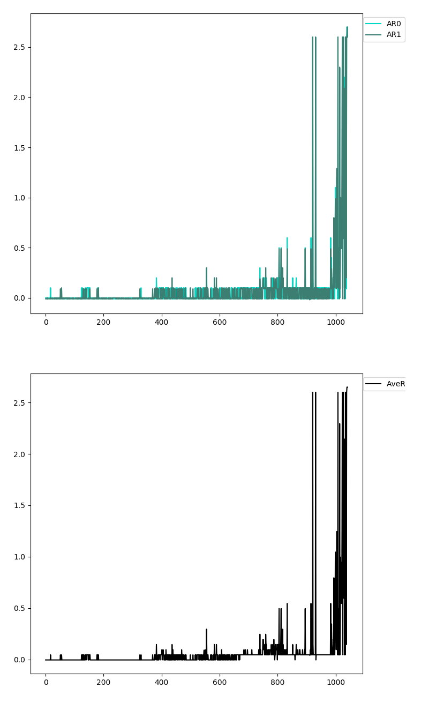

# Report

- [Introduction](#Introduction)  
- [Learning Algorithm](#LearningAlgorithm)  
  - [Multi Agent Deep Deterministic Policy Gradients (**MADDPG**)](#MADDPG)
  - [Models](#Models) 
    - [Actor or Policy](#ActorModel)
    - [Critic or Q Function](#CriticModel)
  - [Networks Update](#Update)
    - [Critic](#UpdateCritic)
    - [Actor](#UpdateActor)
  - [Target Networks Update or Soft Update](#SoftUpdate) 
  - [Experience Replay or Replay Buffer](#ReplayBuffer)
  - [Exploration](#Exploration)
  - [Hyperparameters and Tuning](#Hyperparameters)
- [Results](#Results)
  - [Reward vs Epoch graph](#graph)
  - [Videos](#Videos)
- [Future Ideas](#FutureIdeas)
- [References](#References)
  
<a name="Introduction"/>

## Introduction:

The environment and the goal is introduced in main readme file [here](README.md). 

<a name="LearningAlgorithm"/>

## Learning Algorithm

I have used
* Deep Deterministic Policy Gradients (**DDPG**) and
* Multi Agent Deep Deterministic Policy Gradients (**MADDPG**)

for this project. 

Interestingly 
[my implementation for the second project, DDPG](https://github.com/yosoufe/DRLND_Continuous_Control_P2)
without almost any change solved this multi agent environment. I would not describe the DDPG again here.
You can find my report about DDPG in 
[the other repo](https://github.com/yosoufe/DRLND_Continuous_Control_P2/blob/master/report.md).
I just only did some small updates to save the model in a cleaner fashion. In  
[commit cdbb9ac](https://github.com/yosoufe/DRLND_Collaboration_Competition_P3/commit/cdbb9ace3c11e0a39b3c5a7ad43bcfa8d2993095)
of this repo I tested exact same code of [DDPG](https://github.com/yosoufe/DRLND_Continuous_Control_P2) 
without any change and it solved the environment.I will discuss about the result of DDPG further only 
in the [Results](#Results) section. 

I will describe the MADDPG in the following.

<a name="MADDPG"/>

### Deep Deterministic Policy Gradients (**DDPG**)

MADDPG is introduced in the paper 
[Multi-Agent Actor-Critic for Mixed Cooperative-Competitive Environments](https://arxiv.org/abs/1706.02275).

Quick Facts about DDPG:
* It is an off-policy algorithm.
* It can be used only for environments with continuous action spaces.
* It can be considered as deep Q-learning for continuous action spaces while it is introduced as Actor Critic method.
* Each agent has its own set of Neural Networks

MADDPG is very similar to DDPG. The Differences are:
* There are the same number of set of neural networks as number of interacting agents. For example
in this environment there are two interacting agents therefore there are two sets of Neural Networks 
like DDPG. So each set has the following networks (similar to DDPG with bolded differences):
    *  : Q network or what 
I called `critic_local` in my implementation:
        * Input: states and actions **of all agents**
        * Output: value of the states and actions
    *  : Deterministic policy 
function or what I called `actor_local` in my implementation:
        * Input: states of only the current agent.
        * Output: best believed actions for only current agent.
    *  : target Q network or what I 
called `critic_target` in my implementation which is similar to Q network.
    *  : target policy function or 
what I called `actor_target` in my implementation which is similar to policy function.

In this algorithm, actor network is used to approximate the optimal policy deterministically like DDPG. 
It outputs the best believed action for a given state. Actor is basically predicts 
 which 
is the best action. Critic learns to evaluate the optimal action-value function by using the actor's best believed 
action. Which is an approximate maximizer to calculate new target value for training the action value function.

**The main idea** in the paper is that the critic of each agent has access to the states and actions
of all other agents. But the actor has only access to the states of itself and not others. This way
during the training, each agent uses the information from other agents to evaluate its policy but that is 
not needed during the inference and agent uses only its own states to decide on the action. This is 
shown in [the paper](https://arxiv.org/abs/1706.02275) by the following figure.


<a name="Models"/>

### Models
Neural Network Models are defined in [models.py](models.py).

<a name="ActorModel"/>

#### Actor or Policy
Actor or Policy model consists of:
* I used exactly the same model architecture as DDPG for actor.
* Batch normalization layer at the state inputs. The state values can have very large and small values in different 
dimensions which batch norm can speed up the learning. 
* Multiple linear layers
* `tanh` as last activation because we know the maximum and minimum values for actions are +1 and -1. `Tanh` outputs in 
the same range which makes the learning faster. Be careful that `relu` should not be used at last layer because `relu` outputs
only zero and positive values. I did this mistake and spent some time to find the bug.

The input of model is the states and outputs the best believed actions.
```python
class Actor(nn.Module):
    def __init__(self, state_size, action_size, seed, layer_sizes=[32, 64, 64]):
        super(Actor, self).__init__()
        self.seed = torch.manual_seed(seed)
        self.bn = nn.BatchNorm1d(state_size)
        self.fc1 = nn.Linear(state_size, layer_sizes[0])
        self.fc2 = nn.Linear(layer_sizes[0], layer_sizes[1])
        self.fc3 = nn.Linear(layer_sizes[1], layer_sizes[2])
        self.fc4 = nn.Linear(layer_sizes[2], action_size)

    def forward(self, state):
        x = state
        x = self.bn(x)
        x = F.relu(self.fc1(x))
        x = F.relu(self.fc2(x))
        x = F.relu(self.fc3(x))
        return torch.tanh(self.fc4(x))
```

<a name="CriticModel"/>

#### Critic or Q Function
Critic or Q Function model consists of:
* Batch Normaliztion
* Multiple linear layers
* And no (or linear) activation at last layer.

The only differnce here is that the critic's input is the states and actions of all
agents rather than one agent. The network is also a bit different like this:
```
this agent's state  ->BatchNorm->Linear--\
                                        Concatenate ---> Linear ->\
this agent's action ------------>Linear--/                         \
                                                            Concatenate --> Linear -> Value
other agent's state ->BatchNorm->Linear--\                         /
                                        Concatenate ---> Linear ->/
other agent's action------------>Linear--/
```

The Critic is larger than DDPG because its inputs is larger than DDPG and this would need a more complex
model to learn tasks.

The input of model is the states and actions of all agents and it outputs the 
.
```python
class MACritic(nn.Module):
    def __init__(self,
                 state_size,
                 other_states,
                 action_size,
                 other_actions,
                 seed,
                 layer_sizes=[64, 16, 256, 32]):
        self.state_size=state_size
        self.other_states=other_states
        self.action_size=action_size
        self.other_actions=other_actions

        super(MACritic, self).__init__()
        self.seed = torch.manual_seed(seed)
        self.bn_s = nn.BatchNorm1d(state_size)
        self.bn_so = nn.BatchNorm1d(other_states)
        self.fcState = nn.Linear(state_size, layer_sizes[0])
        self.fcAction = nn.Linear(action_size, layer_sizes[1])

        self.fcState_o = nn.Linear(other_states, layer_sizes[0])
        self.fcAction_o = nn.Linear(other_actions, layer_sizes[1])

        self.fc2 = nn.Linear(layer_sizes[0] + layer_sizes[1], layer_sizes[2])
        self.fc2_o = nn.Linear(layer_sizes[0] + layer_sizes[1], layer_sizes[2])
        self.fc3 = nn.Linear(layer_sizes[2]*2, layer_sizes[3])
        self.fc4 = nn.Linear(layer_sizes[3], 1)

    def forward(self, state, action):
        this_state = state[:, :self.state_size]
        other_state = state[:, self.state_size:]
        this_action = action[:, :self.action_size]
        other_action = action[:, self.action_size:]


        this_state = self.bn_s(this_state)
        other_state = self.bn_so(other_state)

        this_state = F.relu(self.fcState(this_state))
        this_action = F.relu(self.fcAction(this_action))
        other_state = F.relu(self.fcState_o(other_state))
        other_action = F.relu(self.fcAction_o(other_action))

        this_v = F.relu(self.fc2(torch.cat((this_state, this_action), 1)))
        other_v = F.relu(self.fc2_o(torch.cat((other_state, other_action), 1)))

        v = F.relu(self.fc3(torch.cat((this_v, other_v), 1)))
        return self.fc4(v)
```

<a name="Update"/>

### Networks Update

It is very similar to DDPG. My Equations in this sections is only for first agent. 
Similar equations applies to the second agent. Notations here are a bit different. `prime` means 
for the nect time stamp and the subscript is the agent's number (index) and the rest are
according to the paper.

<a name="UpdateCritic"/>

#### Critic
First we calculate the target value for Q function using target critic network 
 as follow


Then we calculate the loss 


<a name="UpdateActor"/>

#### Actor
For actor, the objective is to maximize the expected return

.

We need to calculate the objective's gradient using chain rule

.

<a name="SoftUpdate"/>

### Target Networks Update or Soft Update
It is similar to deep Q-learning method:

* 
* 

where .
```python
def soft_update(self, tau):
    for target_param, local_param in zip(self.actor_target.parameters(), self.actor_local.parameters()):
        target_param.data.copy_(tau * local_param.data + (1.0 - tau) * target_param.data)
    for target_param, local_param in zip(self.critic_target.parameters(), self.critic_local.parameters()):
        target_param.data.copy_(tau * local_param.data + (1.0 - tau) * target_param.data)
```

<a name="ReplayBuffer"/>

### Experience Replay or Replay Buffer
Learning on single sample is usually ending up having a very high variance. Therefore it is essential to 
have a buffer to save the experiments. Then on each step random samples are drawn from the buffer and 
the network is trained on them. This is like we are replaying the old experience. This is very similar to 
deep Q-learning.

<a name="Exploration"/>

### Exploration
We are using [Ornstein–Uhlenbeck process](https://en.wikipedia.org/wiki/Ornstein%E2%80%93Uhlenbeck_process)
added to actions. We are decreasing noise further more in learning.

<a name="Hyperparameters"/>

### Hyperparameters and Tuning
I found DDPG very sensitive to hyper parameters. If the parameters were not chosen correctly
the output of the actor saturates to the extremes very early in the training and comes out of that 
local optima rarely. The corect hyperparameters are also depending on the networks and its complexity.
Here are the chosen parameters:

```python
agents = []
batch_size = 1024
shared_buffer = ReplayBuffer(batch_size=batch_size, buffer_size=300 * 1000, seed=1, device=device)

for _ in range(2):
    agent = MADDPG(state_size=state_size, 
                   action_size=action_size, 
                   actor_model=Actor,
                   critic_model=MACritic,
                   device=device,
                   num_agents= 1, # number of non-interacting agents,
                   num_interacting_agents = 2,
                   seed=1,
                   tau=1e-1,
                   batch_size=batch_size,
                   discount_factor = 0.99,
                   actor_learning_rate=1e-4,
                   critic_learning_rate=1e-3,
                   replayBuffer= shared_buffer) #shared_buffer
    agents.append(agent)
agents[0].set_other_agent(agents[1])
agents[1].set_other_agent(agents[0])
```

I used two critic networks with the same architecture but different initial parameters
and used the average of their output as the target value for critics network. This gave a bit
more stable convergence.

<a name="Results"/>

## Results

As I mentioned before I used both **MADDPG** and **DDPG**.

<a name="graph"/>

### Reward vs Epoch graph
In the following images, the top graph is showing the rewards of each agent and the second 
graph is showing the average over all agents. I set the criteria to consider the environment as 
solve to average rewards of **0.5**.

#### MADDPG

It solved the environment in **460** epochs. Remember that in each epoch two sets of Neural Networks
are being updated. So the computation is heavier in MADDPG rather than simple DDPG.


#### DDPG

It solved the environment in around **1100** epochs. Remember that in each epoch only one set of Neural Networks
are being updated. So the computation is less in DDPG rather than MADDPG.



<a name="Videos"/>

### Videos
Here are some videos of my trained agent:
* MADDPG: https://youtu.be/htyvRehoYIM
* DDPG: https://youtu.be/zPLCWftleTk

And the gif version of the videos, You may click on them to go to High Quality Version on 
Youtube, Or may check the `imgs_vids` folder of the repo:

[](https://youtu.be/htyvRehoYIM)
[](https://youtu.be/zPLCWftleTk)

<a name="FutureIdeas"/>

# Future Ideas
* Using different network models like recurrent networks.

<a name="References"/>

# References
* [Multi-Agent Actor-Critic for Mixed Cooperative-Competitive Environments](https://arxiv.org/abs/1706.02275)